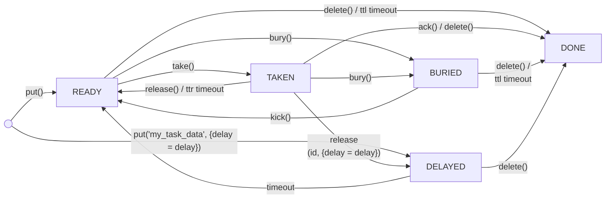
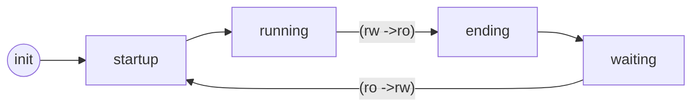

<a href="http://tarantool.org">
   
</a>

[![fast_testing][testing-actions-badge]][testing-actions-url]
[![packaging][packaging-actions-badge]][packaging-actions-url]
[![publish][publish-actions-badge]][publish-actions-url]

# A collection of persistent queue implementations for Tarantool

## Table of contents

* [Queue types](#queue-types)
  * [fifo \- a simple queue](#fifo---a-simple-queue)
  * [fifottl \- a simple priority queue with support for task time to live](#fifottl---a-simple-priority-queue-with-support-for-task-time-to-live)
  * [utube \- a queue with sub\-queues inside](#utube---a-queue-with-sub-queues-inside)
  * [utubettl \- extension of utube to support ttl](#utubettl---extension-of-utube-to-support-ttl)
* [The underlying spaces](#the-underlying-spaces)
  * [Fields of the \_queue space](#fields-of-the-_queue-space)
  * [Fields of the \_queue\_consumers space](#fields-of-the-_queue_consumers-space)
  * [Fields of the \_queue\_taken\_2 space](#fields-of-the-_queue_taken_2-space)
  * [Fields of the \_queue\_session\_ids space](#fields-of-the-_queue_session_ids-space)
  * [Fields of the space associated with each queue](#fields-of-the-space-associated-with-each-queue)
* [Task state diagram](#task-state-diagram)
* [Queue state diagram](#queue-state-diagram)
* [Installing](#installing)
* [Using the queue module](#using-the-queue-module)
  * [Initialization](#initialization)
  * [Get the module version](#get-the-module-version)
  * [Creating a new queue](#creating-a-new-queue)
  * [Set queue settings](#set-queue-settings)
  * [Session identify](#session-identify)
  * [Putting a task in a queue](#putting-a-task-in-a-queue)
  * [Taking a task from the queue ("consuming")](#taking-a-task-from-the-queue-consuming)
  * [Acknowledging the completion of a task](#acknowledging-the-completion-of-a-task)
  * [Releasing a task](#releasing-a-task)
  * [Peeking at a task](#peeking-at-a-task)
  * [Burying a task](#burying-a-task)
  * [Kicking a number of tasks](#kicking-a-number-of-tasks)
  * [Deleting a task](#deleting-a-task)
  * [Dropping a queue](#dropping-a-queue)
  * [Releasing all taken tasks](#releasing-all-taken-tasks)
  * [Getting statistics](#getting-statistics)
  * [Queue and replication](#queue-and-replication)
* [Implementation details](#implementation-details)
  * [Queue drivers](#queue-drivers)
  * [Driver API](#driver-api)

# Queue types

## `fifo` - a simple queue

Features:

* If there is only one consumer, tasks are scheduled in strict FIFO order.
* If there are many concurrent consumers, FIFO order is preserved on
average, but is less strict: concurrent consumers may complete tasks in
a different order.

The following options can be specified when creating a `fifo` queue:
  * `temporary` - boolean - if true, the contents do not persist on disk
(the queue is in-memory only)
  * `if_not_exists` - boolean - if true, no error will be returned if the tube
already exists
  * `on_task_change` - function name - a callback to be executed on every
operation; the expected function syntax is `function(task, stats_data)`, where
`stats_data` is the operation type, and `task` is normalized task data.
    NOTE: It's better to use `:on_task_change()` function.

`fifo` queue does not support:
  * task priorities (`pri`)
  * task time to live (`ttl`)
  * task time to execute (`ttr`)
  * delayed execution (`delay`)

Example:

```lua

-- add a log record on task completion
local function otc_cb(task, stats_data)
    if stats_data == 'delete' then
        log.info("task %s is done", task[1])
    end
end

queue.create_tube('tube_name', 'fifo', {temporary = true, on_task_change = otc_cb})
queue.tube.tube_name:put('my_task_data_1')
queue.tube.tube_name:put('my_task_data_2')

```

In the example above, the `otc_cb` function will be called 2 times, on each task
completion. Values for the callback arguments will be taken from the queue.

## `fifottl` - a simple priority queue with support for task time to live

The following options can be specified when creating a `fifottl` queue:
  * `temporary` - boolean - if true, the contents of the queue do not persist
on disk
  * `if_not_exists` - boolean - if true, no error will be returned if the tube
already exists
  * `on_task_change` - function name - a callback to be executed on every
operation

The following options can be specified when putting a task in a `fifottl` queue:
  * `pri` - task priority (`0` is the highest priority and is the default)
  * `ttl` - numeric - time to live for a task put into the queue, in
seconds. if `ttl` is not specified, it is set to infinity
    (if a task exists in a queue for longer than ttl seconds, it is removed)
  * `ttr` - numeric - time allotted to the worker to work on a task, in
seconds; if `ttr` is not specified, it is set to the same as `ttl`
    (if a task is being worked on for more than `ttr` seconds, its status
is changed to 'ready' so another worker may take it)
  * `delay` - time to wait before starting to execute the task, in seconds

Example:

```lua

queue.create_tube('tube_name', 'fifottl', {temporary = true})
queue.tube.tube_name:put('my_task_data', { ttl = 60.1, delay = 80 })

```

In the example above, the task has 60.1 seconds to live, but the start
of execution is delayed for 80 seconds. Thus the task actually will
exist for up to (60.1 + 80) 140.1 seconds.

A smaller priority value indicates a higher priority, so a task with
priority 1 will be executed after a task with priority 0, if all other
options are equal.

## `limfifottl` - a simple size-limited priority queue with support for task time to live

Works same as fifottl, but has limitied size and put operation timeout.

The following options can be specified when creating a `fifottl` queue:
  * `temporary` - boolean - if true, the contents of the queue do not persist
on disk
  * `if_not_exists` - boolean - if true, no error will be returned if the tube
already exists
  * `on_task_change` - function name - a callback to be executed on every
operation
  * `capacity` - number - limit size of the queue

The following options can be specified when putting a task in a `fifottl` queue:
  * `pri` - task priority (`0` is the highest priority and is the default)
  * `ttl` - numeric - time to live for a task put into the queue, in
seconds. if `ttl` is not specified, it is set to infinity
    (if a task exists in a queue for longer than ttl seconds, it is removed)
  * `ttr` - numeric - time allotted to the worker to work on a task, in
seconds; if `ttr` is not specified, it is set to the same as `ttl`
    (if a task is being worked on for more than `ttr` seconds, its status
is changed to 'ready' so another worker may take it)
  * `delay` - time to wait before starting to execute the task, in seconds
  * `timeout` - numeric - seconds to wait until queue has free space; if
  `timeout` is not specified or time is up, and queue has no space, method return Nil


## `utube` - a queue with sub-queues inside

The main idea of this queue backend is the same as in a `fifo` queue:
the tasks are executed in FIFO order.
However, tasks may be grouped into sub-queues.

It is advised not to use `utube` methods inside transactions with
`read-confirmed` isolation level. It can lead to errors when trying to make
parallel tube methods calls with mvcc enabled.

The following options can be specified when creating a `utube` queue:
  * `temporary` - boolean - if true, the contents of the queue do not persist
on disk
  * `if_not_exists` - boolean - if true, no error will be returned if the tube
already exists
  * `on_task_change` - function name - a callback to be executed on every
operation
  * `storage_mode` - string - one of
    * `queue.driver.utube.STORAGE_MODE_DEFAULT` ("default") - default
      implementation of `utube`
    * `queue.driver.utube.STORAGE_MODE_READY_BUFFER`
      ("ready_buffer") - allows processing `take` requests faster, but
      by the cost of `put` operations speed. Right now this option is supported
      only for `memtx` engine.
      WARNING: this is an experimental storage mode.

    Here is a benchmark comparison of these two modes:
    * Benchmark for simple `put` and `take` methods. 30k utubes are created
      with a single task each. Task creation time is calculated. After that
      30k consumers are calling `take` + `ack`, each in the separate fiber.
      Time to ack all tasks is calculated. The results are as follows:

      |         | put (30k) | take+ack |
      |---------|-----------|----------|
      | default | 180ms     | 1.6s     |
      | ready   | 270ms     | 1.7s     |
    * Benchmark for the busy utubes. 10 tubes are created.
      Each contains 1000 tasks. After that, 10 consumers are created (each works
      on his tube only, one tube — one consumer). Each consumer will 
      `take`, then `yield` and then `ack` every task from their utube 
      (1000 tasks each).
      After that, we can also run this benchmark with 10k tasks on each utube,
      100k tasks and 150k tasks. But all that with 10 utubes and 10 consumers.
      The results are as follows:

      |         | 1k    | 10k  | 50k  | 150k  |
      |---------|-------|------|------|-------|
      | default | 53s   | 1.5h | 100h | 1000h |
      | ready   | 450ms | 4.7s | 26s  | 72s   |

The following options can be specified when putting a task in a `utube`
queue:
  * `utube` - the name of the sub-queue.
Sub-queues split the task stream according to the sub-queue name: it is
not possible to take two tasks
out of a sub-queue concurrently, each sub-queue is executed in strict
FIFO order, one task at a time.

`utube` queue does not support:
  * task priorities (`pri`)
  * task time to live (`ttl`)
  * task time to execute (`ttr`)
  * delayed execution (`delay`)

Example:

Imagine a web crawler, fetching pages from the Internet and finding URLs
to fetch more pages.
The web crawler is based on a queue, and each task in the queue refers
to a URL which the web crawler must download and process.
If the web crawler is split into many worker processes, then the same URL may
show up in the queue many times, because a single URL may be referred to by many
linking pages.
And the worker processes, working in parallel, can cause a denial-of-service on
the site of the  URL. As a result, the web crawler can end up in the web
server's user-agent ban list -- not a desirable outcome.

If the URL's domain name is used as a sub-queue name, this problem can be
solved: all the URLs with the same domain name can be fetched and processed
in strict FIFO order.

## `utubettl` - extension of `utube` to support `ttl`

This queue type is effectively a combination of `fifottl` and `utube`.

It is advised not to use `utubettl` methods inside transactions with
`read-confirmed` isolation level. It can lead to errors when trying to make
parallel tube methods calls with mvcc enabled.

The following options can be specified when creating a `utubettl` queue:
  * `temporary` - boolean - if true, the contents of the queue do not persist
on disk
  * `if_not_exists` - boolean - if true, no error will be returned if the tube
already exists
  * `on_task_change` - function name - a callback to be executed on every
operation
  * `storage_mode` - string - one of
    * `queue.driver.utubettl.STORAGE_MODE_DEFAULT` ("default") - default
      implementation of `utubettl`
    * `queue.driver.utubettl.STORAGE_MODE_READY_BUFFER`
      ("ready_buffer") - allows processing `take` requests faster, but
      by the cost of `put` operations speed. Right now this option is supported
      only for `memtx` engine.
      WARNING: this is an experimental storage mode.

    Here is a benchmark comparison of these two modes:
    * Benchmark for simple `put` and `take` methods. 30k utubes are created
      with a single task each. Task creation time is calculated. After that
      30k consumers are calling `take` + `ack`, each in the separate fiber.
      Time to ack all tasks is calculated. The results are as follows:

      |         | put (30k) | take+ack |
      |---------|-----------|----------|
      | default | 200ms     | 1.7s     |
      | ready   | 320ms     | 1.8s     |
    * Benchmark for the busy utubes. 10 tubes are created.
      Each contains 1000 tasks. After that, 10 consumers are created (each works
      on his tube only, one tube — one consumer). Each consumer will
      `take`, then `yield` and then `ack` every task from their utube
      (1000 tasks each).
      After that, we can also run this benchmark with 10k tasks on each utube,
      100k tasks and 140k tasks. But all that with 10 utubes and 10 consumers.
      The results are as follows:

      |         | 1k    | 10k  | 50k  | 140k  |
      |---------|-------|------|------|-------|
      | default | 80s   | 1.6h | 100h | 1000h |
      | ready   | 520ms | 5.4s | 28s  | 83s   |

The following options can be specified when putting a task in a
`utubettl` queue:
  * `pri` - task priority (`0` is the highest priority and is the default)
  * `utube` - the name of the sub-queue
  * `ttl` - numeric - time to live for a task put into the queue, in
seconds. if `ttl` is not specified, it is set to infinity
    (if a task exists in a queue for longer than ttl seconds, it is removed)
  * `ttr` - numeric - time allotted to the worker to work on a task, in
seconds; if `ttr` is not specified, it is set to the same as `ttl`
    (if a task is being worked on for more than `ttr` seconds, its status
is changed to 'ready' so another worker may take it)
  * `delay` - time to wait before starting to execute the task, in seconds

# The underlying spaces

The queue system consists of fibers, IPC channels, functions, and spaces.
Here is how queues map to spaces in a Tarantool database.

The `_queue` space contains tuples for each queue and its properties.
This space is created automatically when the queue system is initialized for
the first time (for example, by "require 'queue'"), and is re-used on
later occasions.

## Fields of the `_queue` space

1. `tube` - the name of the queue
1. `tube_id` - queue ID, numeric
1. `space` - the name of a space associated with the queue, which
contains one tuple for each queue task
1. `type` - the queue type ('fifo', 'fifottl', 'utube', 'utubettl')
1. `opts` - additional options supplied when creating the queue, for
example 'ttl'

The `_queue_consumers` temporary space contains tuples for each job
which is working on a queue.
Consumers may be simply waiting for tasks to be put in the queues.

## Fields of the `_queue_consumers` space

1. `connection_id` - connection ID of the client
1. `fid` - client fiber ID
1. `tube_id` - queue ID, referring to the `tube_id` field in the `_queue`
space; the client waits for tasks in this queue
1. `timeout` - the client wait timeout
1. `time` - the time when the client took a task

The `_queue_taken_2` (`_queue_taken` is deprecated) space contains
tuples for each job which is processing a task in the queue.

## Fields of the `_queue_taken_2` space

1. `tube_id` - queue ID, to which the task belongs
1. `task_id` - task ID (of the task being taken)
1. `connection_id` - connection ID of the client, referring to the
`connection_id` field of the `_queue_consumers` space
1. `session_uuid` - session UUID (string)
1. `time` - the time when the client began to execute the task

The `_queue_session_ids` space contains a map: connection id (box
session id) to the session UUID. This space is temporary if `in_replicaset`
is set to false.

## Fields of the `_queue_session_ids` space

1. `connection_id` - connection id (numeric)
2. `session_uuid` - session UUID (string)

## Fields of the `_queue_shared_sessions` space

1. `uuid` - session UUID (string)
2. `exp_time` - session expiration time (numeric)
3. `active` - session state (boolean)

This space is temporary if `in_replicaset` is set to false.

Also, there is a space which is associated with each queue,
which is named in the `space` field of the `_queue` space.
The associated space contains one tuple for each task.

## Fields of the space associated with each queue

1. task_id - numeric - see below
2. task_state - 'r' for ready, 't' for taken, etc. - see below
3. task_data - the contents of the task, usually a long string
x. (additional fields if the queue type has options for ttl, priority,
or delay)

The `task_id` value is assigned to a task when it's inserted into a queue.
Currently, `task_id` values are simple integers for `fifo` and `fifottl`
queues.

The `task_state` field takes one of the following values
(different queue types support different
sets of `task_state` values, so this is a superset):

* 'r' - the task is **ready** for execution (the first consumer executing
a `take` request will get it)
* 't' - the task has been **taken** by a consumer
* '-' - the task has been **executed (done)** (a task is removed from the queue
after it has been executed, so this value will rarely be seen)
* '!' - the task is **buried** (disabled temporarily until further changes)
* '~' - the task is **delayed** for some time.

For details on the state transitions, refer to [Task state diagram](#task-state-diagram).

# Task state diagram

The following diagram shows possible transitions between the [task states](#fields-of-the-space-associated-with-each-queue).
For information on the transition triggers, refer to:

* [put()](#putting-a-task-in-a-queue)
* [release()](#releasing-a-task)
* [take()](#taking-a-task-from-the-queue-consuming)
* [kick()](#kicking-a-number-of-tasks)
* [bury()](#burying-a-task)
* [ack()](#acknowledging-the-completion-of-a-task)
* [delete()](#deleting-a-task)
* description of the `timeout`, `ttl timeout`, and `ttr timeout` options in
the sections of the corresponding [queue types](#queue-types).



# Queue state diagram

Queue can be used in a master-replica scheme:

There are five states for queue:
* INIT
* STARTUP
* RUNNING
* ENDING
* WAITING

When the tarantool is launched for the first time,
the state of the queue is always `INIT` until `box.info.ro` is false.

States switching scheme:


Current queue state can be shown by using `queue.state()` method.

In the `STARTUP` state, the queue is waiting for possible data synchronization
with other cluster members by the time of the largest upstream lag multiplied
by two. After that, all taken tasks are released, except for tasks with
session uuid matching shared sessions uuids. This makes possible to take
a task, switch roles on the cluster, and release the task within the timeout
specified by the `queue.cfg({ttr = N})` parameter. And the last step in the
`STARTUP` state is starting tube driver using new method called `start()`.

In the `RUNNING` state, the queue is working as usually. The `ENDING` state calls
`stop()` method. in the `WAITING` state, the queue listens for a change in the
read_only flag.

All states except `INIT` is controlled by new fiber called `queue_state_fiber`.

# Installing

There are three alternative ways of installation.
* Get the `tarantool_queue` package from a repository. For example, on
Ubuntu, say: sudo apt-get install tarantool-queue
* Take the Lua rock from rocks.tarantool.org.
* Take the source files from https://github.com/tarantool/queue, then
build and install.

# Using the `queue` module

## Initialization
```lua
queue = require 'queue'
```

The request "require 'queue'" causes automatic creation of
the `_queue` space, unless it already exists. The same request
also sets the necessary space triggers and other objects
associated with queues.  
If the instance hasn't been configured yet (`box.cfg()` hasn't been called),
the initialization of the queue module will be deferred until the instance will
be configured ("lazy start"). For a good work of the queue, it's necessary to
run the instance in rw mode. If the instance run in ro mode, the initialization
of the queue will be deferred until the instance will be configured in rw mode.
After the instance has been started in rw mode and the queue has been
initialized, it's a bad idea to switch it to ro mode. In the case, an attempt to
do something with a persistent ("temporary" option set to false) queue will fail
(a temporary queue will work fine). In addition, in the case of mode has been
switched, triggers may fail (`_on_consumer_disconnect` for example), which may
cause an inconsistent state of the queue. As for the core drivers that use
background fibers (fifottl, limfifottl, utubettl) - they check the instance mode
on each iteration and will wait until the instance will be switched to rw mode.

## Get the module version
```lua
queue._VERSION
```

Returns the current version of the module.

## Creating a new queue

```lua
queue.create_tube(queue name, queue type [, {options} ])
```

Creates a queue.

The queue name must be alphanumeric and be up to 32 characters long.

The queue type must be 'fifo', 'fifottl', 'utube', or 'utubettl'.

The options, if specified, must be one or more of the options described above
(`temporary` and/or `ttl` and/or `ttr` and/or `pri`, depending on the queue
type).
The `ttr` and `ttl` options can be regarded as defaults, which may be overridden
when a task is put in a queue.

Effect: a tuple is added in the `_queue` space, and a new associated space is
created.

Example: `queue.create_tube('list_of_sites', 'fifo', {temporary = true})`

## Set queue settings

```lua
queue.cfg({options})
```

Set queue settings.  
If an invalid value or an unknown option is used, an error will be thrown.  
Available `options`:
* `ttr` - time to release in seconds. The time after which, if there is no active
connection in the session, it will be released with all its tasks.
* `in_replicaset` - enable replication mode. Must be true if the queue is used
in master and replica mode. With replication mode enabled, the potential loss of
performance can be ~20% compared to single mode. Default value is false.

## Session identify

```lua
queue.identify(session_uuid)
```

In the queue the session has a unique UUID and many connections may share one
logical session. Also, the consumer can reconnect to the existing session during
the`ttr` time.  
To get the UUID of the current session, call the `queue.identify()`
without parameters.  
To connect to the existing session, call the `queue.identify(session_uuid)`
with the UUID of the session.  
In case of attempt to use an invalid format UUID or expired UUID, an error will
be thrown.

Be careful, UUID here is a 16-bit string generated by
[uuid.bin()](https://www.tarantool.io/en/doc/latest/reference/reference_lua/uuid/#lua-function.uuid.bin),
not an object of type UUID.

Usage example:  
Sometimes we need an ability to acknowledge a task after reconnect (because
retrying it is undesirable) or even acknowlegde using another connection.

Example of code for connecting to the old session in case of reconnection:
```lua
local netbox = require('net.box')

local conn = netbox.connect('localhost:1918', { reconnect_after = 5 })
local session_uuid = conn:call('queue.identify')
conn:on_connect(function()
    conn:call('queue.identify', {session_uuid})
end)
```

## Putting a task in a queue

To insert a new task into a queue, use:

```lua
queue.tube.tube_name:put(task_data [, {options} ])
```

The `tube_name` must be the name which was specified by `queue.create_tube`.

The `task_data` contents are the user-defined description of the task,
usually a long string.

The options, if specified, must be one or more of the options described
above
(`ttl` and/or `ttr` and/or `pri` and/or `delay` and/or `utube`, depending on the queue
type).
If an option is not specified, the default is what was specified during
`queue.create_tube`, and if that was not specified, then the default is what
was described above for the queue type. Note: if the `delay` option is
specified, the delay time is added to the ttl time.

Effect: a new tuple is created in the queue's associated space, with
task_id = a number which is equal to the largest `task_id` so far, plus 1
task_state = 'r' (ready)
task_data = whatever the user put in the `task_data` parameter

Returns: the value of the new tuple in the queue's associated space,
also called the "created task".

Example: queue.tube.list_of_sites:put('Your task is to do something',
{pri=2})

After a task has been put in a queue, one of these things may happen:
it may be removed from the queue because its ttl (time to live) expires,
or it may be acted on by a worker (usually with a `take` request).

## Taking a task from the queue ("consuming")

```lua
queue.tube.tube_name:take([timeout])
```

Take a queue task.

The `take` request searches for a task in the queue or sub-queue
(that is, a tuple in the queue's associated space)
which has `task_state` = 'r' (ready), and `task_id` = a value lower
than any other tuple which also has `task_state` = 'r'.

If there is no such task, and timeout was specified, then
the job waits until a task becomes ready or the timeout expires.

Effect: the value of `task_state` changes to 't' (taken).
The `take` request tells the system that the task is being worked on.
It should be followed by an `ack` request when the work is finished.
Additional effect: a tuple is added to the `_queue_taken_2` space.

Returns: the value of the taken tuple, or nil if none was found.
The value of the first field in the tuple (`task_id`) is important
for further requests. The value of the second field in the tuple
(`task_data`) is important as it presumably contains user-defined
instructions for what to do with the task.

Example: t_value = queue.tube.list_of_sites:take(15)

## Increasing TTR and/or TTL for tasks

```lua
queue.tube.tube_name:touch(task_id, increment)
```

Increase `ttr` of running task. Useful if you can't predict in advance
time needed to work on task.

Effect: the value of `ttr` and `ttl` increased by `increment` seconds. If queue
does not support ttr, error will be thrown. If `increment` is lower than zero,
error will be thrown. If `increment` is zero or nil effect is noop. If current
`ttr` of task is 500 years or greater then operation is noop.

Example: t_value = queue.tube.list_of_sites:touch(15, 60)

## Acknowledging the completion of a task

```lua
queue.tube.tube_name:ack(task_id)
```

The worker which has used 'take' to take the task should
use 'ack' to signal that the task has been completed.
The current `task_state` of the tuple should be 't' (taken),
and the worker issuing the `ack` request must have the same ID
as the worker which issued the `take` request.

Effect: the value of `task_state` changes to '-' (acknowledged).
Shortly after this, it may be removed from the queue automatically.

If 'take' occurs but is not soon followed by 'ack'
-- that is, if ttr (time to run) expires, or if the worker disconnects --
the effect is: `task_state` is changed from
't' (taken) back to 'r' (ready).
This effect is the same as what would happen with a `release` request.

Example: queue.tube.list_of_sites:ack(15)

## Releasing a task

```lua
queue.tube.tube_name:release(task_id, opts)
```

Put the task back in the queue.
A worker which has used 'take' to take a task,
but cannot complete it, may make a `release` request
instead of an `ack` request. Effectively, 'ack' implies
successful completion of a taken task, and 'release' implies
unsuccessful completion of a taken task.

Effect: the value of `task_state` changes to 'r' (ready).
After this, another worker may take it.
This is an example of a situation where, due to user intervention,
a task may not be successfully completed in strict FIFO order.

Example: queue.tube.list_of_sites:release(15, {delay=10})

Note: in the above example, the delay option means
"the task cannot be executed again for 10 seconds".

## Peeking at a task

```lua
queue.tube.tube_name:peek(task_id)
```

Look at a task without changing its state.

Effect: this is the same as getting a tuple from the space
associated with the queue: box.space.tube_name:select(task_id).

Returns: the tuple of the task.

Example: queue.tube.list_of_sites:peek(15)

## Burying a task

```lua
queue.tube.tube_name:bury(task_id)
```

If it becomes clear that a task cannot be executed
in the current circumstances, you can "bury" the task
-- that is, disable it until the circumstances change.

Effect: the value of `task_state` changes to '!' (buried).
Since '!' is not equal to 'r' (ready), the task can no longer be taken.
Since '!' is not equal to '-' (complete), the task will not be deleted.
The only thing that can affect a buried task is a `kick` request.

Returns: the tuple value.

Example: queue.tube.list_of_sites:bury(15)

## Kicking a number of tasks

```lua
queue.tube.tube_name:kick(count)
```

Reverse the effect of a `bury` request on one or more tasks.

Effect: the value of `task_state` changes from '!' (buried)
to 'r' (ready), for one or more tasks.

Returns: number of tasks actually kicked.

Example: queue.tube.list_of_sites:kick(99)
(this will change up to 99 buried tasks)

## Deleting a task

```lua
queue.tube.tube_name:delete(task_id)
```

Delete the task identified by `task_id`.

Effect: the current state of `task_state` is not checked.
The task is removed from the queue.

Example: queue.tube.list_of_sites:delete(15)

## Dropping a queue

```lua
queue.tube.tube_name:drop()
```

Reverse the effect of a `create` request.

Effect: remove the tuple from the `_queue` space,
and drop the space associated with the queue.

## Releasing all taken tasks

```lua
queue.tube.tube_name:release_all()
```

Forcibly returns all taken tasks to a ready state.

## Getting statistics

```lua
queue.statistics( [queue name] )
```

Show the number of tasks in a queue broken down by `task_state`, and the number
of requests broken down by the type of request. If the queue name is not
specified, show these numbers for all queues.
Statistics are temporary, they are reset whenever the Tarantool server restarts.

Example:

```lua
queue.tube.tube_name:on_task_change(callback)
```

Replace old `on_task_change` callback or set the new one. Previously set
callback is returned.

Get statistics for given tube:

```lua
queue.statistics('list_of_sites')
---
- tasks:
     taken: 0
     buried: 0
     ready: 0
     done: 2
     delayed: 0
     total: 0
   calls:
     ack: 1
     take: 1
     kick: 1
     bury: 1
     put: 2
     delete: 1
...
```

## Queue and replication

Usage example:

```lua
-- Instance file for the master.
queue = require("queue")
-- Queue is in replicaset.
-- Clean up session after 5 minutes after disconnect.
queue.cfg({ttr = 300, in_replicaset = true})

box.cfg{
  listen = 3301,
  replication = {'replicator:password@127.0.0.1:3301',  -- Master URI.
                 'replicator:password@127.0.0.1:3302'}, -- Replica URI.
  read_only = false,
}

box.once("schema", function()
   box.schema.user.create('replicator', {password = 'password'})
   box.schema.user.grant('replicator', 'replication') -- grant replication role
end)

require('console').start()
os.exit()
```

```lua
-- Instance file for the replica.
queue = require("queue")
-- Queue is in replicaset.
-- Clean up session after 5 minutes after disconnect.
queue.cfg({ttr = 300, in_replicaset = true})
box.cfg{
  listen = 3302,
  replication = {'replicator:password@127.0.0.1:3301',  -- Master URI.
                 'replicator:password@127.0.0.1:3302'}, -- Replica URI.
  read_only = true
}

require('console').start()
os.exit()
```

Start master and replica instances and check queue state:

Master:
```sh
tarantool> queue.state()
---
- RUNNING
...
```

Replica:
```sh
tarantool> queue.state()
---
- INIT
...
```

Now reverse the `read_only` setting of the master and replica and check the
status of the queue again.

Master:
```sh
tarantool> box.cfg({read_only = true})
tarantool> queue.state()
---
- WAITING
...
```

Replica:
```sh
tarantool> box.cfg({read_only = false})
tarantool> queue.state()
---
- RUNNING
...
```

# Implementation details

The implementation is based on the common functions for all queues:

1. controlling the `consumers` (watching connection state/wakeup)
1. similarities of the API
1. spaces to support each tube
1. etc

Each new queue has a "driver" to support it.

## Queue drivers

Mandatory requirements

1. The driver works with tuples. The only thing the driver needs
to know about the tuples is their first two fields: `id` and `state`.
1. Whenever the driver notices that a task state has changed, it must
notify the framework about the change.
1. The driver must not throw exceptions, unless the driver API is misused.
I.e. for normal operation, even errors during normal operation, there
should be no exceptions.

Registering a custom driver

`register_driver(driver_name, tube_ctr)` - queue method is used to register
  a custom driver. The arguments are:
  * driver_name: unique driver name. Must be different from the core drivers
  names.
  * tube_ctr: implementation of tube control methods("create_space" and "new").

## Driver API

Driver class must implement the following API:

1. `new` (constructs an instance of a driver), takes:
    * the space object, in which the driver must store its tasks
    * a callback to notify the main queue framework on a task state change
  (`on_task_change`)
    * options of the queue (a Lua table)
1. `create_space` - creates the supporting space. The arguments are:
    * space name
    * space options
1. `start` - initialize internal resources if any, e.g. start fibers.
1. `stop` - clean up internal resources if any, e.g. stop fibers.

To sum up, when the user creates a new queue, the queue framework
passes the request to the driver, asking it to create a space to
support this queue, and then creates a driver instance, passing to it
the created space object.

The same call sequence is used when the queue is "restarted" after
Tarantool server restart.

The driver instance returned by the `new` method must provide the following
API:

* `tube:normalize_task(task)` - converts the task tuple to the object
which is passed on to the user (removes the administrative fields)
* `tube:put(data[, opts])` - puts a task into the queue.
Returns a normalized task which represents a tuple in the space
* `tube:take()` - sets the task state to 'in progress' and returns the task.
If there are no 'ready' tasks in the queue, returns nil.
* `tube:delete(task_id)` - deletes a task from the queue.
Returns the original task with a state changed to 'done'
* `tube:release(task_id, opts)` - puts a task back to the queue (in the 'ready'
   state)
* `tube:bury(task_id)` - buries a task
* `tube:kick(count)` - digs out `count` tasks
* `tube:peek(task_id)` - return the task state by ID
* `tube:touch(task_id, delta)` - increases `ttr` and `ttl` of the task by delta
seconds. If queue does not support `ttr`, error will be thrown. Returns the task
* `tube:tasks_by_state(task_state)` - return the iterator to tasks in a certain state
* `tube:truncate()` - delete all tasks from the tube. Note that `tube:truncate`
must be called only by the user who created this tube (has space ownership) OR
under a `setuid` function. Read more about `setuid` functions
[here](http://tarantool.org/doc/book/box/authentication.html?highlight=function#functions-and-the-func-space).


[testing-actions-badge]: https://github.com/tarantool/queue/actions/workflows/fast_testing.yml/badge.svg
[testing-actions-url]: https://github.com/tarantool/queue/actions/workflows/fast_testing.yml

[packaging-actions-badge]: https://github.com/tarantool/queue/actions/workflows/packaging.yml/badge.svg
[packaging-actions-url]: https://github.com/tarantool/queue/actions/workflows/packaging.yml

[publish-actions-badge]: https://github.com/tarantool/queue/actions/workflows/publish.yml/badge.svg
[publish-actions-url]: https://github.com/tarantool/queue/actions/workflows/publish.yml
